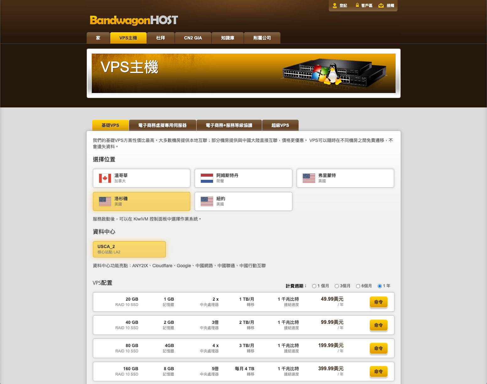
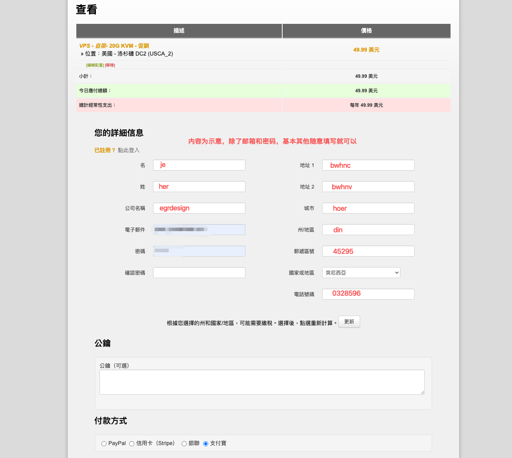
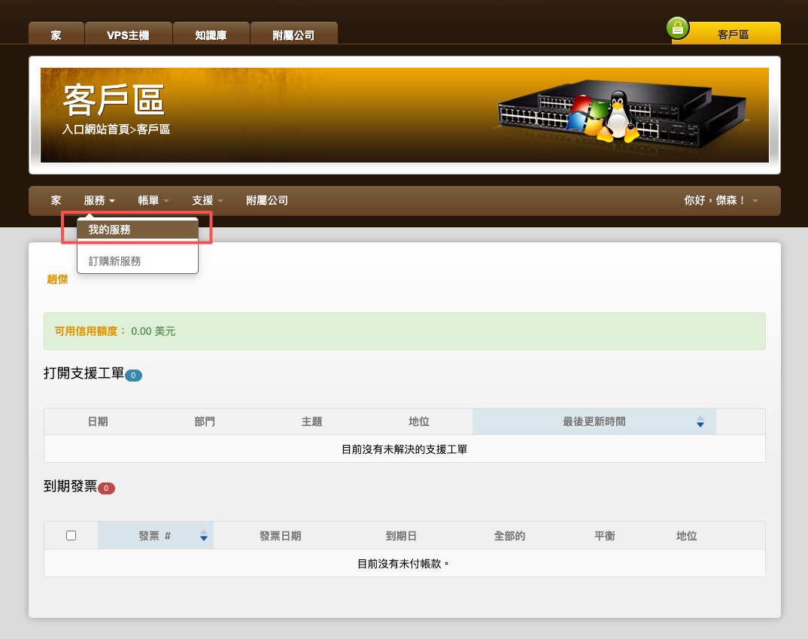
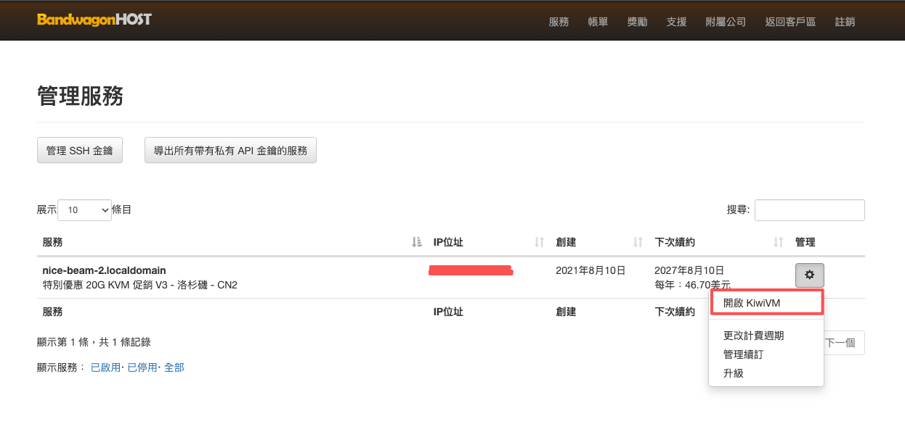
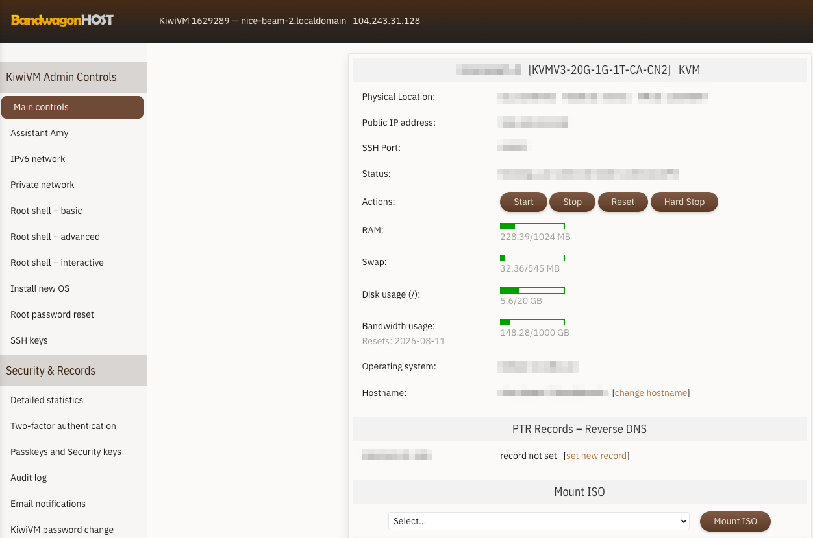
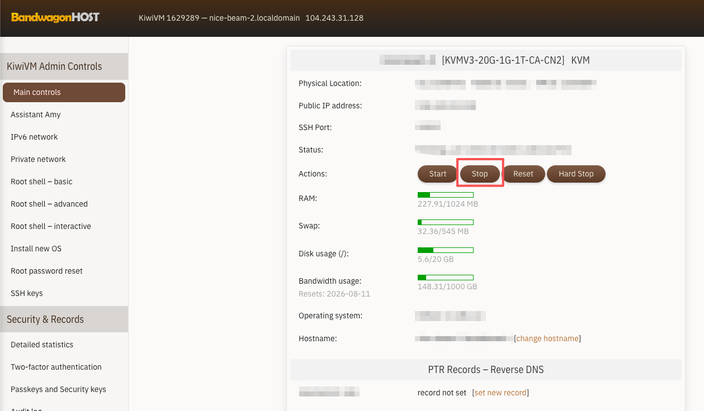
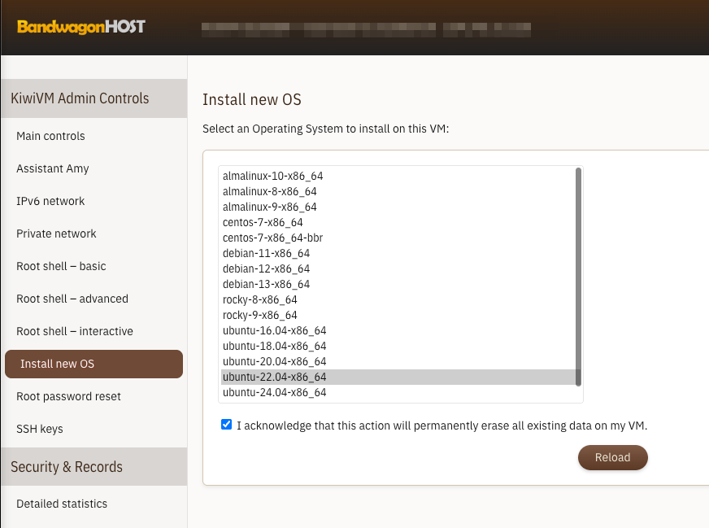

# 搭建个人专属-网络配置指南（Mac 版）
---

> **我推荐自己搭建是因为，我自己的设计工作就需要经常访问国外网站（pinterest 这个网站同行应该都懂），之前用 5、6 家都跑路了，就知道靠别人不如靠自己，从 21 年开始就自己搭建用了 5 年，它除了比那些跑路的稍微贵些（但算上当时发现他跑路的闹心就平复了？），就没其他毛病了。**

## 一、准备工作

1. 一台搬瓦工 VPS（ → [**搬瓦工官方购买链接**](https://bwh88.net/aff.php?aff=71166) ）

> -  1-3 个人使用推荐[洛杉矶节点](https://bwh88.net/aff.php?aff=71166&a=add&pid=44&billingcycle=annually&configoption[10]=35)，按年购买，一个月只要 2 杯奶茶钱（**主要选这个平台是新注册如果不满意享受 30天 全额退款保障**）



1. 注册搬瓦工新用户账户，需要填写购买信息，如下图所示（除了邮箱和登录密码，**其他如实填写或者随意填写都可，不影响**），选择支付方式为**支付宝**，点击**Complete Order**即可跳转到支付页面：



> 付款完毕后你的搬瓦工新账号就注册完毕了。
> 
> 之后就可以看到你刚才购买的服务器的信息，包括机房位置，IP，SSH端口，服务器状态等，**初始密码**会发送到你的注册邮箱。

1. 搬瓦工 KiwiVM 控制面板的登录信息

> （点图一：服务-我的服务；点图二：点管理下方按钮；图三：开启首页就会看到）




1. 建议下载 QoderWork辅助我们搭建（如果中间有哪些按流程执行不下去，直接截图给ai基本就能帮忙安装完成）

---

## 二、获取服务器连接信息

1. 登录搬瓦工 KiwiVM 控制面板（就是上面图三的页面）
2. 在 **Main controls** 页面找到以下三项信息：

| 信息项 | 说明 |
|-|-|
| **IP address** | 服务器 IP 地址（如 `97.64.21.32`） |
| **SSH port** | SSH 端口号（搬瓦工默认不是 22，可能是类似 `12345` 的随机端口） |
| **Root password** | root 密码（如果没有，点 **Root shell - interactive** 旁边的 **Reset root password** 设置一个，这个是在本地终端登录的密码） |

> 💡
> **重要：**记下 IP 和 SSH 端口，后面要用。

1.  接着在 **Main controls** 点击 **stop**，主要用来关闭服务器然后切换到适合我们的服务器；接着点击**Install new OS选择22.04系统，点击Reload确认，大概一两分钟装完。**装完会生成一个新的 root 密码，会显示在页面上，记得复制保存。



---

## 三、连接服务器

按电脑上 **Command + 空格**，搜索"终端"或"Terminal"，回车打开。

输入以下命令（把端口和 IP 换成你自己的）：

```bash
ssh -p 你的SSH端口 root@你的服务器IP
```

例如：

```bash
ssh -p 12345 root@97.64.21.32
```

首次连接会提示 `Are you sure you want to continue connecting (yes/no)?`，输入 **yes** 回车。

然后输入 root 密码（输入时屏幕不会显示字符，正常现象），回车。

看到 `root@xxx:~#` 这样的提示符就说明连接成功了。

> ❓
> **如果连不上：**
> - 确认 IP 和端口没填错（搬瓦工 SSH 端口不是 22）
> - 确认密码正确，不对把系统生成和更新系统生成的密码轮着试下
> - 如果提示 `Connection refused`，可能是服务器还没启动完，等几分钟再试
> - 如果提示 `Connection timed out`，可能是网络问题，换个网络再试

---

## 四、更新系统

连接成功后，先更新系统（这一步很重要，缺少依赖会导致脚本安装失败）：

```bash
apt update && apt upgrade -y
```

等待更新完成（可能需要 1-3 分钟），看到 `root@xxx:~#` 提示符回来了就继续。

---

## 五、安装代理脚本

在服务器终端里输入以下命令后按回车：

```bash
bash <(curl -Ls https://raw.githubusercontent.com/mack-a/v2ray-agent/master/install.sh)
```

> 💡
> **注意：要确认自己是在** `root@xxx` 开头的服务器终端里运行（这代表你登录到了服务器），不要在本地 Mac 终端里运行。

## 六、按提示操作脚本菜单

### 第 1 步：选择安装方式

菜单出现后，输入 **3** 回车（一键无域名 Reality）。

### 第 2 步：选择核心

输入 **1** 回车（Xray-core）。

> 💡
> 不要选 sing-box，保持 Xray 核心可以避免兼容问题。

### 第 3 步：设置 UUID

提示 `请输入自定义UUID[需合法]，[回车]随机UUID` 时，**直接按回车**，让脚本随机生成。

### 第 4 步：记录端口

脚本会显示类似 `---> 端口：19276`，**把这个数字记下来**，后面客户端要用。

### 第 5 步：设置 Reality 伪装域名

提示 `请输入目标域名，[回车]随机域名，默认端口443` 时，**直接按回车**，脚本会随机选一个（如 `www.python.org:443`）。

> 💡
> 这个域名是帮助我们的代理流量"冒充"成访问某个正常网站的流量，从而躲过墙的深度包检测，减少我们被封的几率。

### 第 6 步：生成密钥

提示 `请输入Private Key[回车自动生成]` 时，**直接按回车**。

生成后会显示：

```
privateKey: xxxxxxxxxxxxxxx
publicKey:  yyyyyyyyyyyyyyy
```

**把 publicKey 的值截图或复制保存下来**，后面客户端链接里要用。

### 第 7 步：等待安装完成

脚本会自动配置并启动 Xray。看到绿色的 **"Xray启动成功"** 就成功了。

如果看到红色的 **"Xray启动失败"**，执行以下命令修复：

```bash
chmod -R 755 /etc/v2ray-agent/xray/conf
chmod 644 /etc/v2ray-agent/xray/conf/*.json
systemctl restart xray
systemctl status xray --no-pager
```

确认状态显示 `active (running)` 绿色字样。

---

## 七、开放防火墙端口

在服务器终端执行（把 `19276` 换成你第 4 步记下的实际端口）：

```bash
apt install ufw -y
ufw allow 19276/tcp
ufw --force enable
```

> 💡
> 搬瓦工没有云控制台安全组，只需要这一步就够了。

---

## 八、获取客户端链接

脚本安装完成后，执行以下命令查看配置文件：

```bash
cat /etc/v2ray-agent/xray/conf/07_VLESS_vision_reality_inbounds.json
```

从输出中按下表找到对应信息：

| 参数 | 从配置文件的哪里找 |
|-|-|
| **UUID** | `"id": "xxx"` 的值 |
| **服务器IP** | 你的搬瓦工 IP |
| **端口** | `"port": 19276` 的值 |
| **publicKey** | `"publicKey": "xxx"` 的值 |
| **sni** | `"serverNames"` 里的值（如 [www.python.org](http://www.python.org)） |
| **sid** | `"shortIds"` 里**非空**的那个值（如果有空字符串 `""`，跳过它，用另一个） |

把找到的值填入下面的模板，拼出完整链接：

```
vless://UUID@服务器IP:端口?security=reality&encryption=none&pbk=公钥&headerType=none&fp=chrome&spx=%2F&type=tcp&flow=xtls-rprx-vision&sni=伪装域名&sid=shortId#001
```

例如拼出来是这样：

```
vless://ed15477e-e2e1-4891-87c1-de6323640f19@97.64.21.32:19276?security=reality&encryption=none&pbk=LJZq4HriKE0kQOjZQrqPjyyaH2hPyeVeVvOCcOVGyl4&headerType=none&fp=chrome&spx=%2F&type=tcp&flow=xtls-rprx-vision&sni=www.python.org&sid=6ba85179e30d4fc2#001
```

> 💡
> 如果你感觉怕出错，可以截图参数信息给QoderWork输入：给我把这些整理成一个完整的 vless 链接
> **关键检查：**`sid=` 后面不能为空，必须有值。如果 shortIds 里只有 `""`，说明配置有问题。

**把拼好的完整链接复制保存下来。**

---

## 九、Mac 客户端配置（Hiddify）

### 第 1 步：确认 Mac 芯片类型

点左上角苹果图标 → **关于本机** → 看"芯片"或"处理器"一栏：

- 显示 **Intel** → 下载 x64 版本
- 显示 **Apple M1/M2/M3/M4** → 下载 arm64 版本

### 第 2 步：下载 Hiddify

1. 打开浏览器访问：[https://github.com/hiddify/hiddify-app/releases](https://github.com/hiddify/hiddify-app/releases)
2. 找到最新版本：

   - **Intel Mac**：下载 `Hiddify-MacOS-x64.dmg`
   - **M1/M2/M3/M4 Mac**：下载 `Hiddify-MacOS-arm64.dmg`
3. 双击 dmg 文件，把 Hiddify 拖到 Applications 文件夹
4. 首次打开如果提示"无法验证开发者"，去 **系统设置 → 隐私与安全性**，点击"仍要打开"

> 💡
> 如果下载不了可以用网盘备份：MAC-通用版，链接 
> 百度网盘链接: https://pan.baidu.com/s/1vJlhDdat565v2C9lWdcBKA 提取码: 9ph7 
> 夸克网盘链接: https://pan.quark.cn/s/adc7f6becbf8 提取码：mH33

### 第 3 步：导入节点

1. 打开 Hiddify
2. 点击左上角 **+** 按钮
3. 选择 **从剪贴板导入**
4. 粘贴刚才保存的 vless 链接
5. 点击确认

### 第 4 步：连接

1. 在主页**点击刚添加的节点**使其被选中（高亮）
2. 点击底部的**大圆形连接按钮**
3. 等待状态变为 **"已连接"**

### 第 5 步：设置代理模式

1. 点击左侧 **配置选项**
2. **服务模式** 选择 **"系统代理"**
3. **路由规则** 选择 **"绕过局域网和大陆"** 或 **"智能分流"**（不同版本文字可能略有不同）

> ❗
> **如果连接成功但网页打不开：**在 Hiddify 的 **配置选项** 中找到 **远程 DNS**，改为 `https://1.1.1.1/dns-query`（DoH 模式）。

---

## 十、验证代理是否生效

代理配置完成后，打开浏览器访问：

```
https://ipinfo.io
```

- 如果显示的 IP 是你**服务器的 IP**（如 `97.64.21.32`），说明代理生效了
- 如果显示的是你**本地的 IP**，说明代理没生效，检查客户端设置

然后访问 Google 试试。

---

## 十一、多人使用：给每个人单独发链接

给每个人在服务器上开一个「专属入口」，入口编号（端口）和暗号（shortId）都不同，所以链接人人不一样。转发给别人用不了，想停掉谁就删谁的入口，不影响其他人。

### 第 1 步：想好 3 个信息

1. 这个人的名字代号：小写英文，比如 `zhangsan`
2. 给他一个端口号：你自己的端口是 19276，就给他 `19277`，再下一个人用 19278，别重复就行
3. 你的服务器 IP（前面记过的）
4. 登录进服务器

### 第 2 步：复制整段命令，改好开头 3 行再执行

把下面整段复制到服务器终端，**只改开头标注的 3 行**，然后回车：

```bash
# ===== 只改这 3 行 =====
NAME=zhangsan       # 改成：这个人的名字代号（小写英文）
PORT=19277          # 改成：给他的端口号
IP=97.64.21.32      # 改成：你的服务器 IP
# =======================

apt install jq -y
SID=$(openssl rand -hex 8)
SRC=/etc/v2ray-agent/xray/conf/07_VLESS_vision_reality_inbounds.json
jq --argjson port $PORT --arg sid "$SID" --arg tag "user-$NAME" \
  '.inbounds[0].port=$port | .inbounds[0].tag=$tag | .inbounds[0].streamSettings.realitySettings.shortIds=[$sid]' \
  $SRC > /etc/v2ray-agent/xray/conf/08_user_$NAME.json
ufw allow $PORT/tcp
systemctl restart xray

UUID=$(jq -r '.inbounds[0].settings.clients[0].id' $SRC)
PBK=$(jq -r '.inbounds[0].streamSettings.realitySettings.publicKey' $SRC)
SNI=$(jq -r '.inbounds[0].streamSettings.realitySettings.serverNames[0]' $SRC)
echo "=============================="
echo "$NAME 的专属链接（复制保存）："
echo "vless://$UUID@$IP:$PORT?security=reality&encryption=none&pbk=$PBK&headerType=none&fp=chrome&spx=%2F&type=tcp&flow=xtls-rprx-vision&sni=$SNI&sid=$SID#$NAME"
```

这一段会自动做完四件事：生成他的专属配置 → 开端口 → 重启生效 → 直接打印出他的专属链接，全程不用手动编辑任何文件。

### 第 3 步：复制链接发给他

屏幕最后输出的 `vless://` 开头那一整行就是他的链接，末尾的 `#zhangsan` 是备注。

他自己拿到后按「九、Mac 客户端配置」导入 Hiddify 就能用，什么都不用改。

> 💡
> **再加一个人：**回到第 1 步，换个名字和端口，把第 2 步那段命令再粘贴一遍。

### 不让某人用了

只删他一个人，别人不受影响（把 `zhangsan` 换成那个人的名字）：

```bash
rm /etc/v2ray-agent/xray/conf/08_user_zhangsan.json
systemctl restart xray
```

### 专属链接用不了怎么办

- 先执行 `systemctl status xray --no-pager`，不是绿色 `active (running)` 就说明没启动成功
- 启动失败多半是端口撞了 → 换一个端口号重新来一遍
- 如果状态正常但链接还是不通，按上一章「问题 3：服务启动但用的旧配置」处理一次再重启

> 💡
> **提醒：**大家的链接虽然各用各的，但出口还是同一台服务器——服务器被封所有人一起断。要彻底隔离只能一人一台 VPS。

## 十二、常见问题排查

### 问题 1：Hiddify 连接成功但网页打不开

1. 在 Hiddify **配置选项**中，把 **远程 DNS** 改为 `https://1.1.1.1/dns-query`
2. 把 **服务模式** 切换为 **"TUN 模式"**（比系统代理更彻底）
3. 断开重连

### 问题 2：Xray 启动失败（服务器端）

在服务器终端执行：

```bash
chmod -R 755 /etc/v2ray-agent/xray/conf
chmod 644 /etc/v2ray-agent/xray/conf/*.json
systemctl restart xray
systemctl status xray --no-pager
```

### 问题 3：服务启动但用的旧配置

```bash
rm -f /etc/systemd/system/xray.service.d/10-donot_touch_single_conf.conf
systemctl daemon-reload
systemctl restart xray
```

### 问题 4：查看服务状态和日志

```bash
# 查看运行状态
systemctl status xray --no-pager

# 查看最近日志
journalctl -u xray --since "5 min ago" --no-pager
```

> ❗
> **如果以上排查没有，可以给我们留言或者截图给 workbuddy，基本都可以解决**。

## 十三、日常维护命令

| 操作 | 命令 |
|-|-|
| 查看服务状态 | `systemctl status xray --no-pager` |
| 重启服务 | `systemctl restart xray` |
| 查看日志 | `journalctl -u xray --since "5 min ago" --no-pager` |
| 重新运行脚本菜单 | `bash <(curl -Ls https://raw.githubusercontent.com/mack-a/v2ray-agent/master/install.sh)` |
